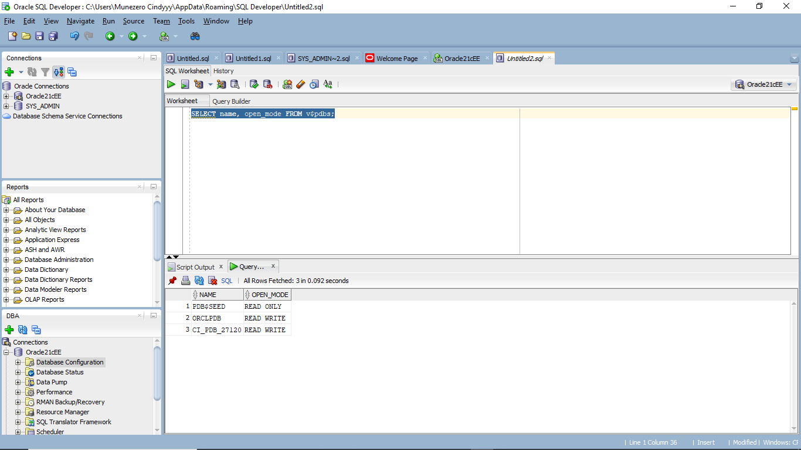
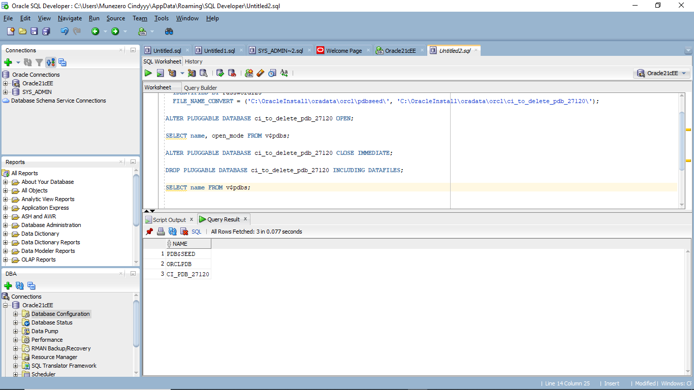
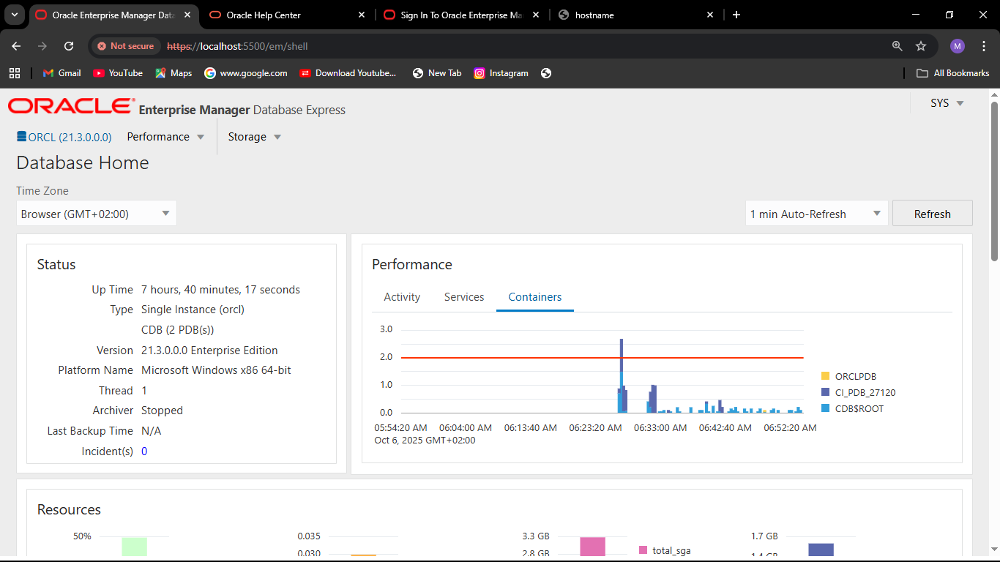
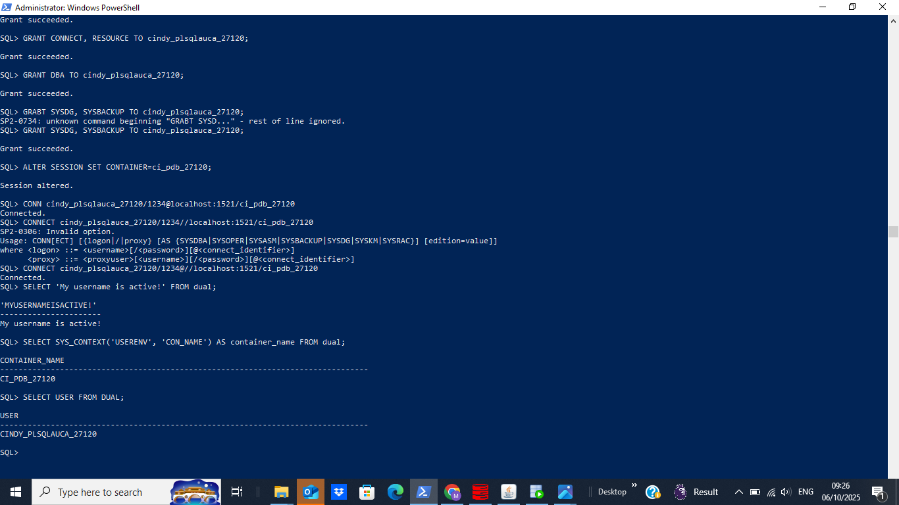

# Oracle Database Administration Lab

## 📋 Project Overview
This repository contains the complete lab work for Oracle Database Administration tasks, including PDB creation, user management, and Oracle Enterprise Manager configuration.

## 👤 Student Information
- **Name:** MUNEZERO  Cindy
- **Student ID:** 27120
- **Course:** PL/SQL 
- **Submission Date:** 6 Oct,2025

## 🎯 Lab Objectives
1. Create and manage Pluggable Databases (PDBs)
2. Implement user security and authentication
3. Configure Oracle Enterprise Manager (OEM)
4. Demonstrate database administration skills

## 📂 Repository Structure
oracle-dba-lab/
├── README.md
├── screenshots/
│ ├── First_pdb.png
│ ├── OEM_dashboard.png
│ ├── dropping_pdb2.png
│ ├── pdb2_deleted.png
│ └── Second_pdb.png

## 🛠️ Tasks Completed

### Task 1: Main PDB Creation
- Created PDB: `ci_pdb_27120`
- Created User: `cindy_plsqlauca_27120`
- Configured tablespaces and privileges

*Caption: Successful creation of ci_pdb_27120 using CREATE PLUGGABLE DATABASE command*

### Task 2: PDB Lifecycle Management
- Created temporary PDB: `ci_to_delete_pdb_27120`
- Demonstrated complete deletion with datafiles

*Caption: Creation of ci_to_delete_pdb_27120 for deletion demonstration*

*Caption: Successful deletion using DROP PLUGGABLE DATABASE INCLUDING DATAFILES*

### Task 3: OEM Configuration
- Configured HTTP/HTTPS ports (8080/8443)
- Accessed Oracle Enterprise Manager dashboard
- Verified user authentication

*Caption: OEM dashboard with pdb ci_pdb_27120*

## 📸 Evidence
All tasks are documented with screenshots showing:
- Successful PDB creation and deletion
- User connection verification
- OEM port configuration
- Dashboard access with username

## 🚀 How to Use
1. Review `readme.md` for detailed documentation
2. Check `screenshots/` folder for visual evidence

## 📝 Notes
- All tasks completed successfully
- Used Oracle Database 21c Enterprise Edition
- Mixed use of SQL*Plus and SQL Developer
- Proper security practices implemented

## 🔗 Connection Details
Host: localhost
Port: 1521
PDB: ci_pdb_27120
User: cindy_plsqlauca_27120
guide me on how to push my screenshots folder to my git, using mac terminalrepo name:oracle-dba-lab-Munezero-Cindy,the readme is already there,what i want is just to push the screenshots folder plz.
